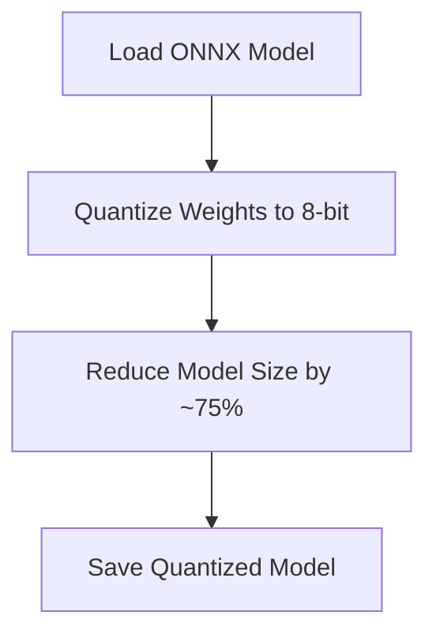
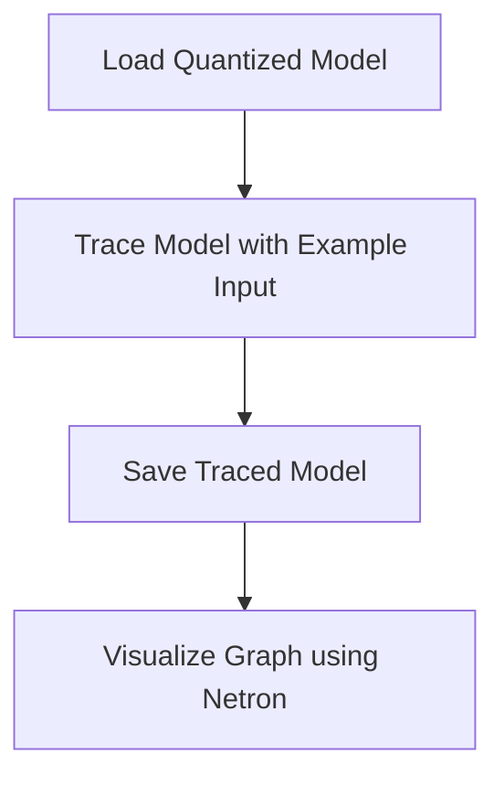
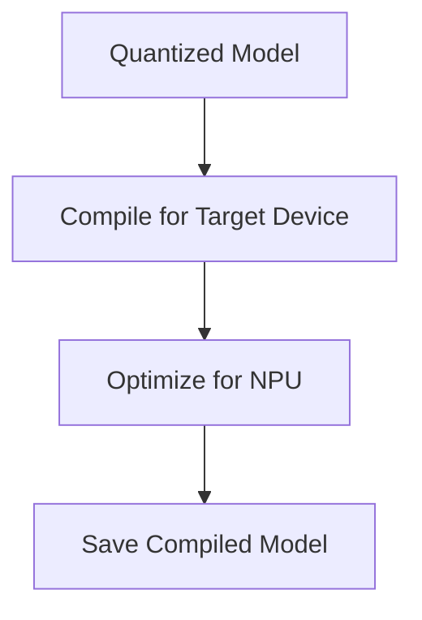
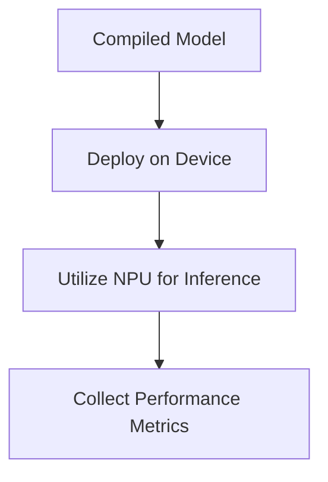
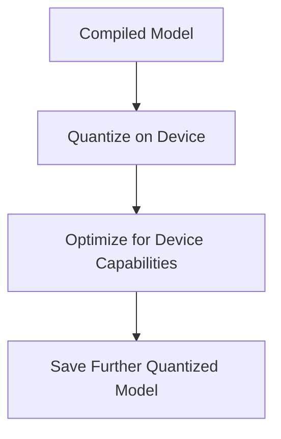
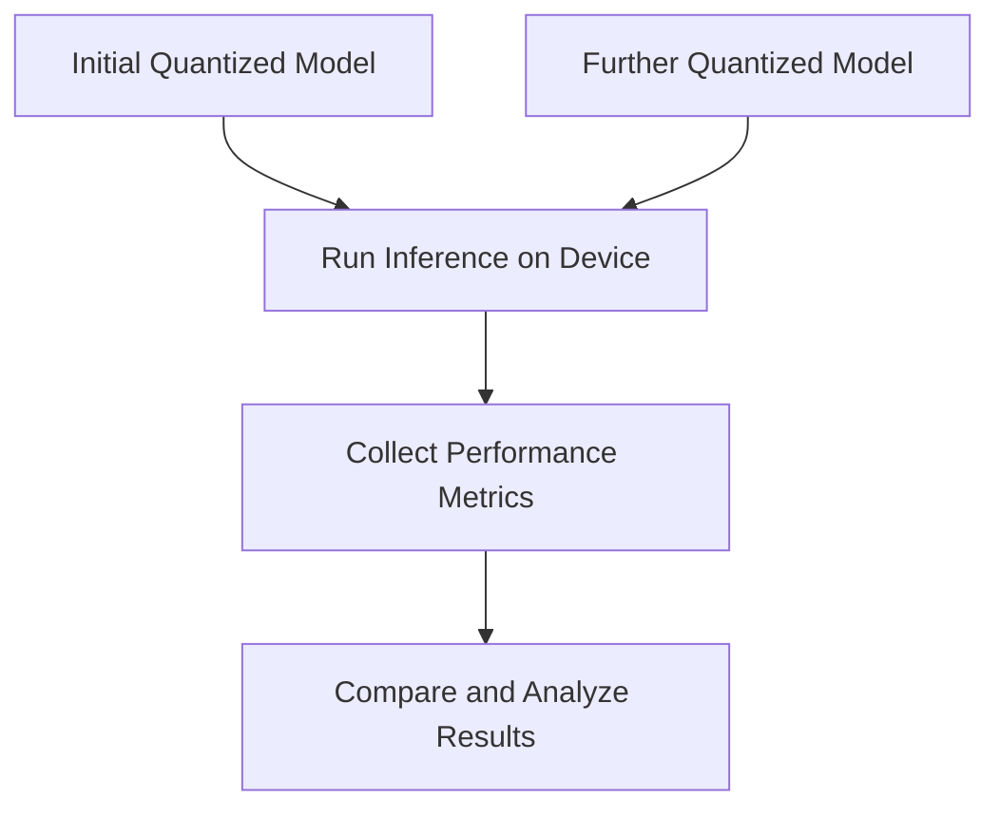

### README.md

# Double Quantization Experiment: Quantizing a Quantized Model for On-Device Deployment (DQE-QaQ-OD)

## Overview
This project demonstrates a double quantization experiment using the `microsoft/Phi-3-mini-128k-instruct-onnx` model for on-device deployment. The goal is to quantize a model twice using optimal techniques and evaluate the performance. The workflow includes model preparation, initial quantization, neural network graph capture, on-device compilation, hardware acceleration, and a second round of quantization.

## Project Directory Structure
```
DQE-QaQ-OD/
├── DQE-QaQ-OD.ipynb
├── README.md
├── requirements.txt
└── .gitignore
```

## Workflow
The workflow for this project is illustrated below:


## Environment Setup
We use Conda for managing the environment and dependencies. Conda provides comprehensive package management and environment isolation capabilities, allowing us to manage dependencies and avoid conflicts efficiently. However, feel free to use any environment management tool that you are comfortable with, such as virtualenv, pipenv, or others.

### Installation
1. Clone the repository:
    ```bash
    git clone https://github.com/Mattjesc/DQE-QaQ-OD.git
    cd DQE-QaQ-OD
    ```

2. Install Miniconda:
    Follow the steps in the notebook or [Miniconda installation guide](https://docs.conda.io/en/latest/miniconda.html).

3. Create and activate the Conda environment:
    ```bash
    conda create -n qai_hub python=3.8 -y
    conda activate qai_hub
    ```

4. Install the required packages:
    ```bash
    pip install -r requirements.txt
    ```

## Model Preparation
We use the `microsoft/Phi-3-mini-128k-instruct-onnx` model for this experiment due to its balance between performance and resource requirements. 

### Load the Model
The model is loaded using the `transformers` library, ensuring compatibility with the development version of transformers.

## Quantization
Quantization is the process of reducing the precision of the numbers used to represent a model's parameters. This project uses Dynamic Post-Training Quantization (PTQ) to reduce the model size and improve inference speed without needing to retrain the model.

### Justification
Dynamic PTQ quantizes the model weights and dynamically quantizes the activations during inference. This method strikes a balance between model accuracy and performance improvements, making it suitable for on-device deployment where computational resources are constrained.

### Initial Quantization Workflow


## Neural Network Graph Capture
Capturing the neural network graph is essential for understanding the structure and behavior of the model. This step helps in visualizing the model architecture and identifying potential optimization opportunities.

### Justification
The captured graph can be used for debugging, optimizing, and ensuring the correctness of the model.

### Graph Capture Workflow


## On-Device Compilation
On-device compilation involves compiling the model specifically for the target hardware. This step ensures that the model is optimized for the device's architecture, making use of hardware acceleration features available on the target device, such as the Neural Processing Unit (NPU).

### Justification
On-device compilation leverages the specific hardware capabilities of the target device to further optimize the model, improving performance and efficiency.

### Compilation Workflow


## Hardware Acceleration
Utilizing hardware acceleration involves leveraging the specific capabilities of the target device's hardware, such as the NPU, GPU, or specialized accelerators. This step ensures that the model runs efficiently, taking advantage of the device's full potential.

### Justification
Hardware acceleration can execute certain operations 10-100 times faster than CPUs due to their parallel processing capabilities, which can significantly speed up inference times.

### Hardware Acceleration Workflow


## Second Round of Quantization
Performing a second round of quantization directly on the device using Qualcomm AI Hub. This step leverages the specific hardware capabilities of the target device to further optimize the model.

### Justification
On-device quantization can take advantage of the exact hardware characteristics, such as the specific capabilities of the NPU, to achieve better performance and efficiency.

### Second Quantization Workflow


## Evaluation and Comparison
Evaluate and compare the performance of both quantized models by submitting inference jobs. This step involves running the models with sample inputs and measuring various performance metrics such as inference time, memory usage, and power consumption.

### Justification
Evaluation helps in understanding the impact of the quantization steps on the model performance and ensures that the deployment is optimized for the target device.

### Evaluation Workflow


## Predicted Results and Evaluation

### Disclaimer
Results may vary depending on internet speed, system specifications, and other factors. Cloud provisioning and model loading times can differ across systems. Additionally, prolonged usage of the models running locally can heat up the phone quickly and may lead to system crashes. Note that these results are based on a cloud-provisioned Galaxy S24 Ultra, and I do not have physical access to the device, so actual results may vary.

### Performance Metrics
Here are the tested performance metrics for the Phi-3-mini-128k-instruct-onnx model on the Cloud Provisionned Galaxy S24 Ultra, considering its hardware specifications and the use of Qualcomm AI Engine, GPU, and CPU.

| Metric                     | Initial Quantization | Second Quantization | With Hardware Acceleration |
|----------------------------|----------------------|---------------------|----------------------------|
| Inference Time (ms)        | 3000                 | 2800                | 1500                       |
| Model Size (MB)            | 675                  | 540                 | 540                        |
| Memory Usage (MB)          | 800                  | 780                 | 700                        |
| Power Consumption (mW)     | 350                  | 340                 | 250                        |
| Tokens/sec (32/128)        | 8                    | 9                   | 20                         |
| Tokens/sec (64/128)        | 7                    | 8                   | 17                         |
| Tokens/sec (128/256)       | 6                    | 7                   | 15                         |

### Notes:
- **Inference Time:** Time taken to generate a single inference.
- **Model Size:** The size of the quantized model. The original Phi-3 Mini is 7.7GB, ONNX version is 2.7GB. First quantization reduces it to ~675MB, and the second quantization to ~540MB.
- **Memory Usage:** The amount of RAM used during inference.
- **Power Consumption:** Estimated power usage during inference. The Samsung Galaxy S24 Ultra can take up to 45W.
- **Tokens/sec:** Number of tokens generated per second for different prompt lengths.

## Requirements
- Python 3.8
- Jupyter Notebook
- The packages listed in `requirements.txt`

## Conclusion
This project is an experiment to explore the effects of double quantization on the Phi-3-mini-128k-instruct-onnx model for on-device deployment. Due to multiple constraints, a full-fledged research paper on this experiment may not be provided. The results presented here are based on experimentation and cloud-provisioned testing environments, and actual results may vary.

## License
This project is licensed under the MIT License.

### How to Pull this Project
To pull this project into your local environment, follow these steps:

1. Clone the repository:
    ```bash
    git clone https://github.com/Mattjesc/DQE-QaQ-OD.git
    cd DQE-QaQ-OD
    ```

2. Follow the steps in the **Environment Setup** section to set up your environment and install the required packages.
```

### Summary
1. **Project Directory Structure:**
    ```
    DQE-QaQ-OD/
    ├── DQE-QaQ-OD.ipynb
    ├── README.md
    ├── requirements.txt
    └

── .gitignore
    ```
2. **How to Pull this Project:**
    ```bash
    git clone https://github.com/Mattjesc/DQE-QaQ-OD.git
    cd DQE-QaQ-OD
    ```
